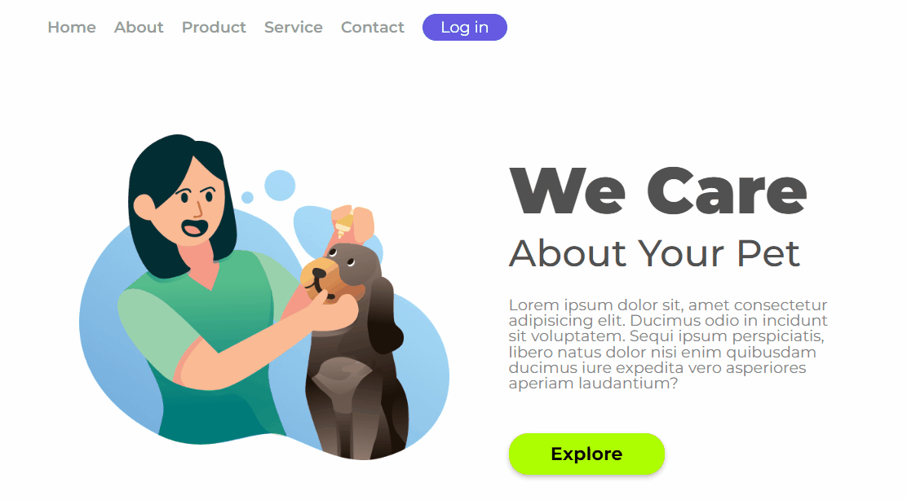

### Projeto Desenvolvido no Curso DevClub🚀 

### Desenvolver um menu
### Posicionar elementos 
### Deixar Responsivo

[]

 
 

### Tecnologias Utilizadas

 Html
 
   CSS

  #### Desenvolvido por Márcia